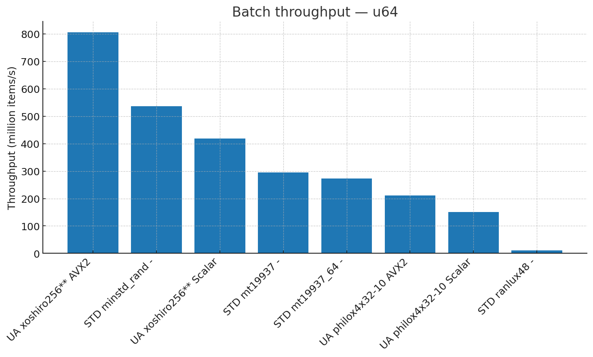
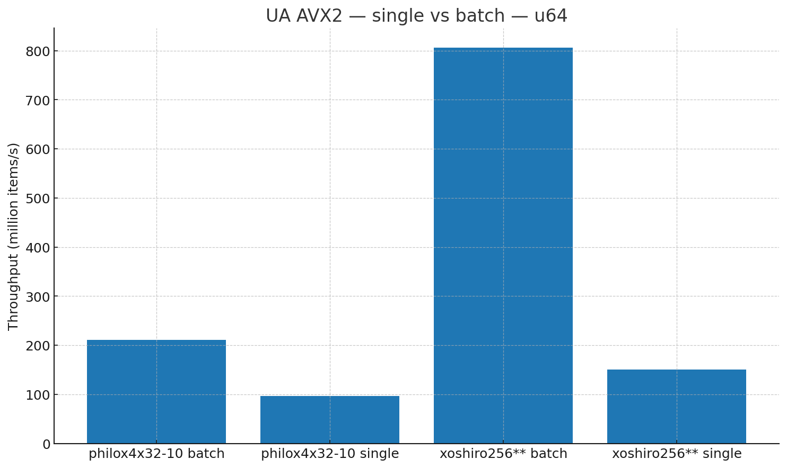
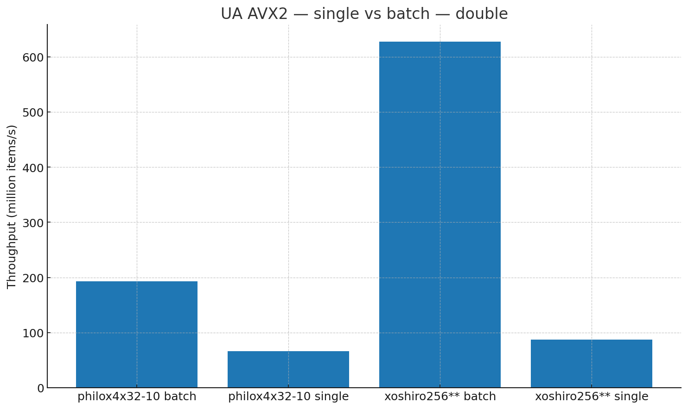
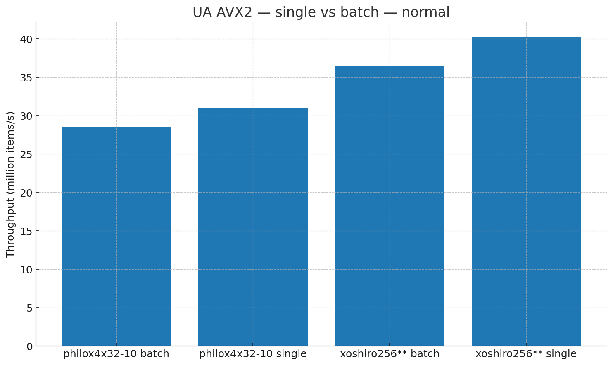
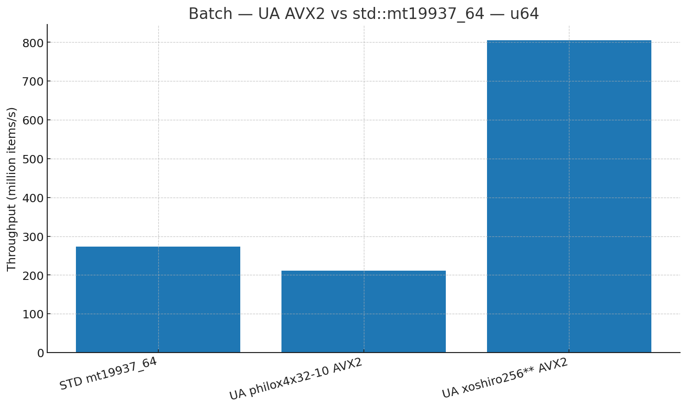
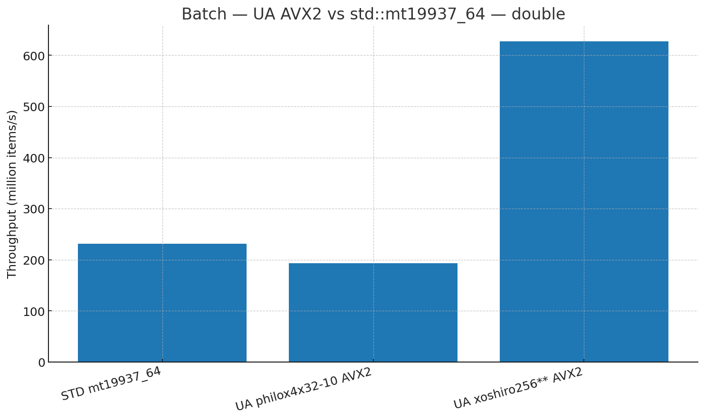
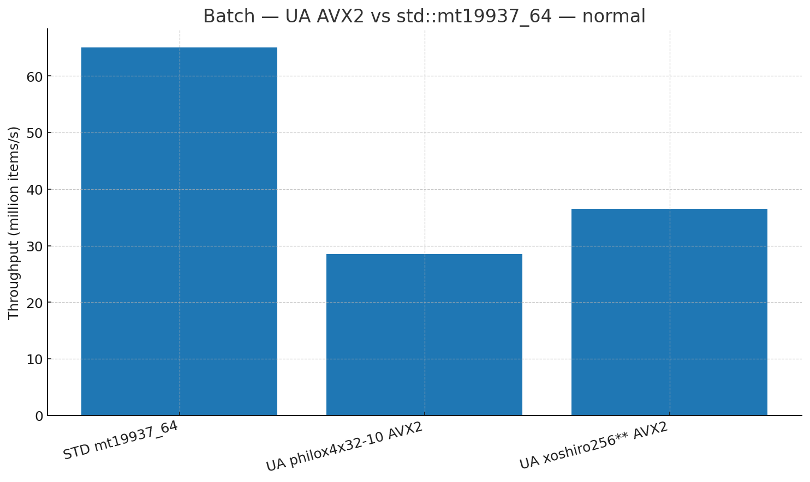

\# Universal Architecture RNG Library (v1.6)


The \*\*Universal Architecture RNG Library\*\* is a high-performance, cross-platform, SIMD-accelerated random number generator suite, designed for benchmarking, cryptography-adjacent research, and any application that demands extreme throughput and statistical sanity.


It supports multiple RNG algorithms, scalar and SIMD execution paths (SSE2, AVX2, with room for AVX-512), and provides drop-in C++ integration as a static or shared library.


---


\## ✨ Features


\- \*\*Multiple high-quality RNG algorithms:\*\*

&nbsp; - \[`xoshiro256\*\*`](http://prng.di.unimi.it/)

&nbsp; - \[`philox4x32-10`](https://www.thesalmons.org/john/random123/papers/random123sc11.pdf)

&nbsp; - C++ `<random>` standard library engines for comparison

\- \*\*Multiple backends:\*\*

&nbsp; - Scalar (portable)

&nbsp; - SSE2 (128-bit SIMD)

&nbsp; - AVX2 (256-bit SIMD)

\- \*\*Full double (`double`), integer (`uint64\_t`), and normalized float generation\*\*

\- \*\*Multi-threaded scaling tests\*\* with CPU affinity pinning for repeatable performance metrics

\- \*\*Benchmarks vs. C++ standard RNG\*\*

\- \*\*Statistical sanity checks\*\* (mean, variance) for normalized outputs

\- \*\*Builds as both:\*\*

&nbsp; - Standalone benchmarking tools (`rng\_lockbench`, `rng\_compare`, `rng\_scale`)

&nbsp; - A compiled library (`.lib` / `.a`) for integration


---


\## 📂 Project Structure


/src → Core RNG implementations

/include → Public headers for library consumers

/bench → Benchmark utilities and performance testing

/build → CMake build output (ignored in repo)

/cmake → CMake scripts and configuration


bash

Copy

Edit


Key source files:

\- `src/universal\_rng.cpp` → Main RNG implementations + SIMD specializations

\- `include/universal\_rng.h` → Public API

\- `bench/bench\_lock\_and\_bench.cpp` → Lockstep performance benchmark

\- `bench/bench\_compare\_rngs.cpp` → Algorithm vs. algorithm comparison

\- `bench/bench\_scale.cpp` → Multi-thread scaling benchmark


---


\## ⚡ Building


\### Prerequisites

\- CMake ≥ 3.16

\- C++17 or later

\- A compiler with SIMD intrinsics support (GCC, Clang, MSVC)

\- Windows (MSVC) or Linux (GCC/Clang)


\### Build Commands

```bash

\# Clone the repository

git clone https://github.com/yourname/universal-architecture-rng-lib.git

cd universal-architecture-rng-lib/v1.6


\# Create build directory

mkdir build \&\& cd build


\# Configure (choose Release for best performance)

cmake .. -DCMAKE\_BUILD\_TYPE=Release


\# Build all targets

cmake --build . --config Release

Resulting binaries/libraries:


Windows (MSVC) → .lib in build/Release/


Linux (GCC/Clang) → .a in build/


Benchmark executables in build/Release/ (Windows) or build/ (Linux)


🔧 Using as a Library

Add the include/ directory to your project and link against the compiled library.


Example:


cpp

Copy

Edit

\#include "universal\_rng.h"


int main() {

&nbsp;   UniversalRNG rng;

&nbsp;   rng.seed(0xdeadbeefcafebabeULL);


&nbsp;   uint64\_t x = rng.next\_u64();

&nbsp;   double d = rng.next\_double();

&nbsp;   double n = rng.next\_normalized();


&nbsp;   return 0;

}

Compile \& link:


bash

Copy

Edit

g++ -O3 -mavx2 -std=c++17 main.cpp -L/path/to/build -luniversal\_rng

🏎 Benchmarks

Example AVX2 single-thread results (Release build, Windows, i9 CPU):


makefile

Copy

Edit

SIMD: AVX2 enabled

sizes: u64=16777216  dbl=8388608  nrm=8388608   seed=0xdeadbeefcafebabe  stream=7


=== xoshiro256\*\* ===

u64:   18.50 ms  (907.07 M u64/s)

dbl:   12.33 ms  (680.56 M dbl/s)

norm: 230.34 ms  (36.42 M nrm/s)

sanity: mean=0.000193  var=0.999358


=== philox4x32-10 ===

u64:   78.28 ms  (214.32 M u64/s)

dbl:   42.43 ms  (197.69 M dbl/s)

norm: 294.55 ms  (28.48 M nrm/s)

sanity: mean=0.000224  var=0.999558

📊 Multi-thread Scaling

The rng\_scale benchmark sweeps thread counts, binds threads to logical cores, and reports scaling efficiency. Use this to find optimal thread counts for your hardware.


Run:


bash

Copy

Edit

./rng\_scale --threads 1,2,4,8,16

📈 Comparing RNG Algorithms

The rng\_compare tool runs all selected RNGs against the same workloads and outputs:


Throughput (ops/sec)


Statistical sanity metrics


Optional CSV logging for plotting


Example:


bash

Copy

Edit

./rng\_compare --csv results.csv

🛠 Command-line Options

All benchmarks support:


css

Copy

Edit

--threads N           Number of threads to use

--batch-size N        Number of samples per batch

--csv file.csv        Save results to CSV

--affinity            Enable CPU affinity pinning

--help                Show usage

🔮 Roadmap

AVX-512 optimizations


More algorithms (e.g., SplitMix, PCG64, Tyche)


Optional cryptographic PRNG backends


Hardware RNG (RDRAND, RDSEED) integration


Direct Python bindings


📜 License

MIT License — free for personal and commercial use.


💬 Acknowledgments

Thanks to the authors of xoshiro and philox, and to all SIMD ninjas whose work inspired this library.


pgsql

Copy

Edit


---


README additions (Performance plots)
markdown
Copy
Edit
## 📊 Performance Plots

Below are quick visual summaries from our latest bench runs.  
If you clone this repo, the PNGs live under `docs/plots/`.

### Batch-mode throughput (higher is better)

**u64**


**double**


**normal(0,1)**


### UA AVX2: single vs batch

**u64**


**double**


**normal(0,1)**


### UA vs. std::mt19937_64 (batch)

**u64**


**double**


**normal(0,1)**
